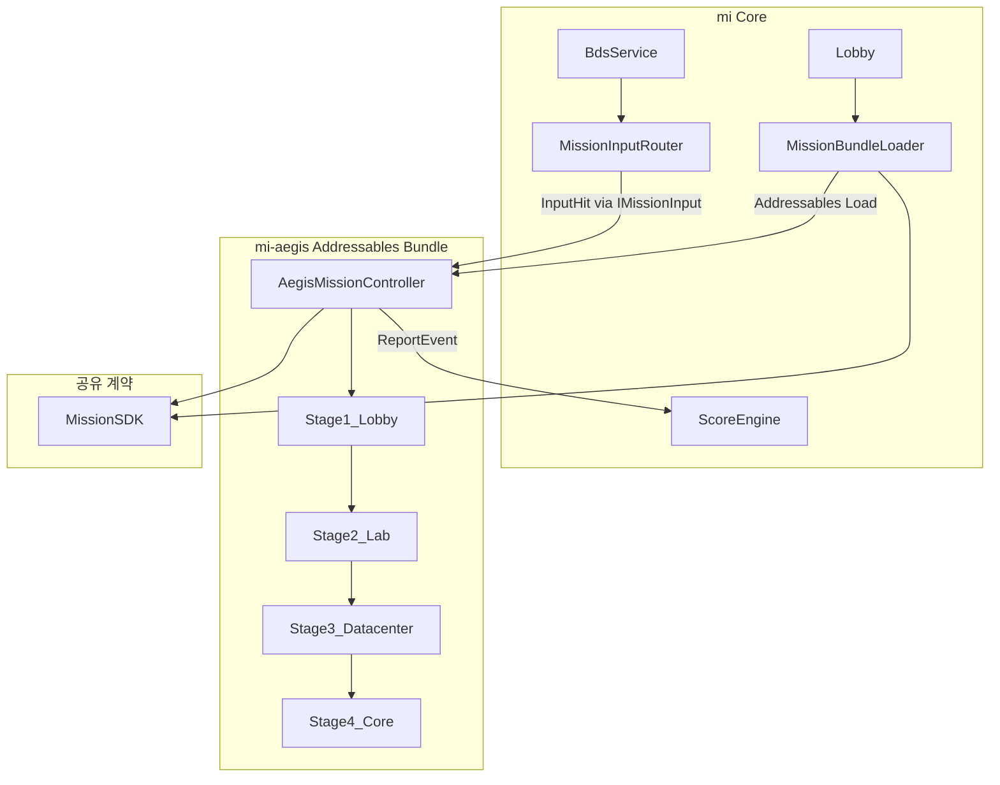
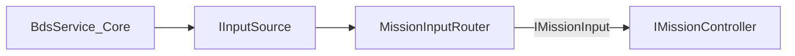
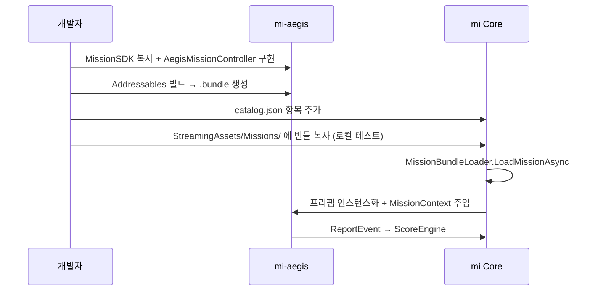

# MI-COMMON — mi 공통 기능 연동 가이드

mi-aegis(AEGIS)는 [mi](https://github.com/pinksoft/mi) 프로젝트(PinkSoft Mission System, PMS)의 **외부 미션 번들**입니다. 이 문서는 mi 프로젝트의 공통 기능(MissionSDK)을 mi-aegis에 어떻게 가져오고, Addressables로 빌드·배포하여 mi Core에서 로드하는지 정리합니다.

## 관련 문서

| 프로젝트 | 문서 | 내용 |
|----------|------|------|
| mi | [`docs/mission-sdk-v1.md`](../mi/docs/mission-sdk-v1.md) | Mission SDK v1 스펙 |
| mi | [`docs/decisions/addressables.md`](../mi/docs/decisions/addressables.md) | Addressables 채택 ADR |
| mi-aegis | [`README.md`](README.md) | AEGIS 게임 개요 |
| mi-aegis | [`docs/stages/`](docs/stages/) | Stage 1~4 상세 기획 |

---

## 1. 역할과 책임 분리

### mi (PMS Core)

- BDS/LiDAR 하드웨어 입력 (`BdsService`)
- 입력 소스 관리 및 라우팅 (`MissionInputRouter`)
- 미션 세션·점수 집계 (`MissionSessionController`, `ScoreEngine`)
- 미션 번들 동적 로드 (`MissionBundleLoader`)
- 로비, 백엔드 API, 센서 교정

### mi-aegis (외부 미션)

- `IMissionController` 구현 (AEGIS 레일 슈터 게임플레이)
- Stage 1~4 씬·에셋·UI
- Addressables 빌드 산출물 (`.bundle` + catalog)

### 공유 계약 (MissionSDK)

- mi와 mi-aegis **양쪽 모두** `Assets/MissionSDK/` 소스를 포함
- Core 전용 코드(`Assets/Core/`, `Assets/BDS/`)는 mi-aegis에 **포함하지 않음**

**번들 구성:** `aegis_rail_shooter` 단일 미션 번들 1개. 내부에서 Stage 1~4를 순차 진행합니다.

---

## 2. 아키텍처



### 런타임 흐름

1. mi 로비에서 `aegis_rail_shooter` 미션 선택
2. `MissionBundleLoader`가 Addressables 번들(또는 로컬 폴백) 로드
3. 루트 프리팹 인스턴스화 후 `MissionContext` 주입
4. `MissionInputRouter.Bind()` — BDS/Touch 입력이 활성 미션으로 라우팅
5. `AegisMissionController.InitializeMission(user, context)` — `context.Input` 구독
6. 게임플레이 중 `ReportEvent` → Core `ScoreEngine`이 점수 계산
7. 미션 종료 → `Shutdown()` → `router.Unbind()`

### BDS는 Core 상주, 미션은 InputHit만 수신



- **BDS/LiDAR/UART/교정:** Core `BdsService` 전용. 미션 번들에 포함하지 않음.
- **미션:** `MissionContext.Input`(`IMissionInput`)으로 가공된 `InputHit`만 구독.
- **Raw LiDAR:** 미션에 전달하지 않음.

---

## 3. mi-aegis에 가져와야 할 공통 기능 (MissionSDK)

mi 프로젝트 [`Assets/MissionSDK/Runtime/`](../mi/Assets/MissionSDK/Runtime/)의 3개 파일을 mi-aegis Unity 프로젝트 `aegis/Assets/MissionSDK/Runtime/`에 추가합니다.

| 파일 | 내용 |
|------|------|
| `InputTypes.cs` | `InputHit`, `IMissionInput`, `MissionContext`, `MissionInputSubscription`, `MissionHitUtility` |
| `MissionTypes.cs` | `IMissionController`, `ScoreEventType`, `RuntimeUserData`, `MissionConfig`, `MissionResultData` |
| `MissionSDKVersion.cs` | SDK `1.0.0`, major 호환 검사 |

### 의존 방식

| 시점 | 방식 |
|------|------|
| **현재 (권장)** | mi 레포에서 MissionSDK 소스를 `aegis/Assets/MissionSDK/Runtime/`로 복사 (mi 로드맵 B-8 UPM 패키지 배포 전) |
| **향후** | `com.pinksoft.mission-sdk` UPM 패키지로 전환 |

```bash
# MissionSDK 복사 예시
cp -r ../mi/Assets/MissionSDK/Runtime aegis/Assets/MissionSDK/
```

### mi-aegis에 포함하면 안 되는 것

| 경로 | 이유 |
|------|------|
| `Assets/BDS/` | LiDAR 하드웨어 스택 — Core 전용 |
| `Assets/Core/` | `BdsService`, `MissionInputRouter`, `ScoreEngine`, `PinkSoftApiClient` |
| `backend/` | REST API — PMS 플랫폼 백엔드 |

---

## 4. mi-aegis에서 구현해야 할 핵심 코드

### 4.1 `AegisMissionController` (`IMissionController`)

mi 내장 미션 [`TargetPracticeMission.cs`](../mi/Assets/Missions/Runtime/TargetPracticeMission.cs) 패턴을 따릅니다.

```csharp
// aegis/Assets/Missions/Runtime/AegisMissionController.cs
using System;
using System.Collections.Generic;
using PinkSoft.MissionSDK;
using UnityEngine;

namespace PinkSoft.Aegis.Missions
{
    public sealed class AegisMissionController : MonoBehaviour, IMissionController
    {
        [SerializeField] LayerMask targetLayer;

        readonly MissionInputSubscription _inputSub = new();
        readonly List<ScoreEventRecord> _log = new();

        int _currentStage;
        bool _ended;

        public event Action<int>? OnScoreChanged;
        public event Action<bool, MissionResultData>? OnMissionEnded;
        public event Action<MissionError>? OnError;

        public void InitializeMission(RuntimeUserData userData, MissionContext context)
        {
            _currentStage = 0;
            _ended = false;
            _log.Clear();

            if (context.Input == null)
            {
                OnError?.Invoke(new MissionError
                {
                    code = MissionErrorCode.InitializationFailed,
                    message = "MissionContext.Input is null"
                });
                return;
            }

            _inputSub.Subscribe(context.Input, HandleHit);
            // Stage 1 로드, context.Config.timeLimitSeconds 등 반영
        }

        void HandleHit(InputHit hit)
        {
            if (_ended) return;

            if (!MissionHitUtility.TryRaycast(hit, targetLayer, out var rh))
                return;

            ReportEvent(ScoreEventType.TargetHit, rh.collider.name);
        }

        public void OnPause() { /* 일시정지 처리 */ }
        public void OnResume() { /* 재개 처리 */ }

        public void Shutdown()
        {
            _inputSub.Unsubscribe();
        }

        public void ReportEvent(ScoreEventType eventType, string targetId)
        {
            _log.Add(new ScoreEventRecord
            {
                eventType = eventType,
                targetId = targetId,
                timestampMs = (int)(Time.time * 1000f)
            });
            // Stage 전환, 종료 조건 판정 등
        }

        void Finish(bool success)
        {
            if (_ended) return;
            _ended = true;
            OnMissionEnded?.Invoke(success, new MissionResultData
            {
                playTime = (int)Time.time,
                eventLog = _log
                // finalScore, starsEarned는 Core가 계산
            });
        }
    }
}
```

### 4.2 AEGIS `ReportEvent` 매핑

미션은 **점수 숫자를 직접 올리지 않습니다.** `ReportEvent`로 이벤트만 보고하고 Core `ScoreEngine`이 가중치를 적용합니다.

| 게임 이벤트 | `ScoreEventType` | `targetId` 예시 |
|-------------|------------------|-----------------|
| 적 처치 | `TargetHit` | `"enemy_soldier_01"` |
| 인질 오사 | `Penalty` | `"hostage_friendly_fire"` |
| 보스 파괴 | `ObjectiveComplete` | `"boss_apc"` |
| 연속 적중 | `Combo` | `"combo_5"` |
| 스테이지 클리어 보너스 | `TimeBonus` | `"stage1_clear"` |

### 4.3 입력 처리

- `InputHit.ScreenPosition` → `MissionHitUtility.TryRaycast(hit, layerMask, out rh)`
- BDS/Touch 입력 소스는 mi Core `MissionInputRouter`가 처리 — mi-aegis는 `IMissionInput`만 구독
- 레일 슈터 조준: `Camera.main` 기준 Raycast, 적/인질/약점에 `LayerMask` 분리

```csharp
readonly MissionInputSubscription _inputSub = new();

public void InitializeMission(RuntimeUserData user, MissionContext context)
{
    _inputSub.Subscribe(context.Input, HandleHit);
}

public void Shutdown()
{
    _inputSub.Unsubscribe();
}

void HandleHit(InputHit hit)
{
    if (MissionHitUtility.TryRaycast(hit, targetLayer, out var rh))
        ReportEvent(ScoreEventType.TargetHit, rh.collider.name);
}
```

### 4.4 미션 프리팹 구조 (권장)

```
AegisMission (루트, AegisMissionController 부착)
├── StageManager
├── UI (조준 마커, HUD)
└── Stages/
    ├── Stage1_Lobby
    ├── Stage2_Lab
    ├── Stage3_Datacenter
    └── Stage4_Core
```

Stage별 상세 기획은 [`docs/stages/`](docs/stages/)를 참조하세요.

---

## 5. Addressables 설정 (mi-aegis)

mi-aegis Unity 프로젝트 [`aegis/`](aegis/)에 Addressables 파이프라인을 구축합니다.

> **참고:** mi Core 쪽 Addressables는 ADR 채택 상태이나 패키지 미설치·로더 스텁 수준입니다 (mi 로드맵 Track B-5). mi-aegis가 먼저 Addressables 빌드 파이프라인을 구축해도 되며, mi Core와는 `StreamingAssets` 폴백으로 통합 테스트할 수 있습니다.

### 5.1 패키지 설치

`aegis/Packages/manifest.json`에 `com.unity.addressables` 패키지를 추가합니다. Unity 6000.5 LTS와 호환되는 버전을 Package Manager에서 선택하세요.

Unity 에디터에서 **Window → Asset Management → Addressables → Groups**로 설정 UI를 엽니다.

### 5.2 Addressables 그룹 구성

| 그룹 | 포함 에셋 | 빌드 모드 |
|------|-----------|-----------|
| `Aegis_Mission` | `AegisMission` 프리팹 (루트) | Remote |
| `Aegis_Stages` | Stage 1~4 씬/프리팹 | Remote (의존성) |
| `Aegis_Assets` | 적, 보스, VFX, 오디오 | Remote |

- 루트 프리팹 Addressable 주소: `aegis_rail_shooter` (mi `MissionBundleLoader`가 `missionId`로 프리팹을 찾음)
- 빌드 산출물: `aegis_rail_shooter_{version}.bundle` + catalog

### 5.3 mi catalog 등록

mi [`catalog.json`](../mi/Assets/StreamingAssets/Missions/catalog.json)에 항목을 추가합니다 (mi 쪽 작업).

```json
{
  "missionId": "aegis_rail_shooter",
  "title": "이지스 (AEGIS)",
  "description": "넥사 코어 빌딩 침투 — 4스테이지 레일 슈터",
  "author": "PinkSoft",
  "version": "1.0.0",
  "bundleUrl": "https://cdn.pinksoft.io/missions/aegis_rail_shooter.bundle",
  "requiredLevel": 1,
  "entryFee": 0,
  "timeLimit": 3600,
  "targetScore": 10000,
  "category": "official"
}
```

| 필드 | 설명 |
|------|------|
| `missionId` | 번들 내 프리팹 식별자. Addressable 주소와 일치 |
| `version` | SemVer. `MissionSDKVersion.Current`와 major 일치 필수 |
| `bundleUrl` | 원격 카탈로그 URL 또는 번들 직접 URL |
| `bundleHash` | (선택) SHA256 hex — 무결성 검증 |

### 5.4 버전 호환

- `MissionSDKVersion.Current` = `"1.0.0"`
- major 버전이 다르면 mi `MissionBundleLoader.ValidateMetadata()`가 로드 거부
- mi-aegis 빌드 시 `catalog.json`의 `version` 필드와 SDK 버전을 동기화

---

## 6. 개발 워크플로우



### 로컬 통합 테스트 (Addressables 미완 전)

mi `MissionBundleLoader`는 `StreamingAssets/Missions/{missionId}_{version}.bundle` 폴백을 지원합니다.

```bash
# mi-aegis에서 빌드한 번들을 mi 프로젝트로 복사
cp aegis_rail_shooter_1.0.0.bundle \
   ../mi/Assets/StreamingAssets/Missions/aegis_rail_shooter_1.0.0.bundle
```

mi 에디터에서 로비 → AEGIS 미션 선택 → 로드·플레이 테스트.

### mi-aegis 단독 테스트

mi-aegis 프로젝트에서 마우스 클릭으로 `InputHit`을 시뮬레이션하여 MissionSDK 연동을 검증할 수 있습니다. BDS 없이 `MissionHitUtility.TryRaycast`와 `ReportEvent` 흐름만 확인하는 용도입니다.

---

## 7. 기술 스택 정렬

양쪽 프로젝트에서 동일 버전을 유지합니다. URP 셰이더/머티리얼 호환을 위해 Built-In RP는 사용하지 않습니다.

| 패키지 | mi | mi-aegis |
|--------|-----|----------|
| Unity | 6000.5.2f1 | 6000.5.2f1 |
| URP | 17.5.0 | 17.5.0 |
| Input System | 1.19.0 | 1.19.0 |

---

## 8. 권장 폴더 구조

```
mi-aegis/
├── MI-COMMON.md              ← 이 문서
├── README.md
├── docs/stages/
└── aegis/                    ← Unity 프로젝트
    └── Assets/
        ├── MissionSDK/Runtime/     ← mi에서 복사
        ├── Missions/Runtime/       ← AegisMissionController
        ├── Missions/Prefabs/       ← AegisMission 프리팹
        ├── Scenes/                   ← 미션/스테이지 씬
        │   └── Stages/               ← Stage 1~4 스테이지 씬
        ├── AddressableAssetsData/  ← Addressables 설정 (생성)
        └── Settings/               ← URP (기존)
```

---

## 9. 구현 체크리스트

- [x] MissionSDK 3파일을 `aegis/Assets/MissionSDK/Runtime/`에 추가
- [x] `com.unity.addressables` 패키지 설치
- [x] `AegisMissionController` (`IMissionController`) 구현
- [x] `MissionInputSubscription`으로 입력 구독/해제
- [x] Stage 1~4 플레이스홀더 씬 생성 (`Assets/Scenes/Stages/Stage1~4`)
- [x] `AegisMission` 루트 프리팹 생성 및 Addressables `aegis_rail_shooter` 등록
- [ ] Addressables Remote 빌드 및 mi `StreamingAssets` 복사 (Unity 메뉴: **Build Addressables** → **Copy Bundle To mi StreamingAssets**)
- [x] `catalog.json` 메타데이터 작성 및 mi에 등록
- [ ] mi Core와 통합 테스트 (StreamingAssets 폴백)
- [x] BDS/Core 코드 미포함 (mi-aegis에 `PinkSoft.Core` / `Assets/BDS` 없음)

### Unity 에디터 메뉴

mi-aegis 프로젝트를 연 뒤:

| 메뉴 | 동작 |
|------|------|
| **PinkSoft → AEGIS → Setup Mission (Prefab + Addressables)** | `AegisMission` 프리팹 생성 및 `aegis_rail_shooter` Addressable 등록 |
| **PinkSoft → AEGIS → Create Stage Placeholder Scenes** | `Assets/Scenes/Stages/Stage1~4` 플레이스홀더 씬 생성 |
| **PinkSoft → AEGIS → Create Dev Test Scene** | `AegisMissionDev` 단독 테스트 씬 생성 |
| **PinkSoft → AEGIS → Build Addressables** | Addressables 빌드 (비동기 스케줄) |
| **PinkSoft → AEGIS → Copy Bundle To mi StreamingAssets** | 빌드 산출물을 mi 로컬 테스트 경로로 복사 |

---

## 10. 참조 파일 (mi 프로젝트)

| 용도 | 경로 |
|------|------|
| SDK 스펙 | [`docs/mission-sdk-v1.md`](../mi/docs/mission-sdk-v1.md) |
| Addressables ADR | [`docs/decisions/addressables.md`](../mi/docs/decisions/addressables.md) |
| SDK 소스 | [`Assets/MissionSDK/Runtime/`](../mi/Assets/MissionSDK/Runtime/) |
| 참고 미션 | [`Assets/Missions/Runtime/TargetPracticeMission.cs`](../mi/Assets/Missions/Runtime/TargetPracticeMission.cs) |
| 번들 로더 | [`Assets/Core/Runtime/MissionBundleLoader.cs`](../mi/Assets/Core/Runtime/MissionBundleLoader.cs) |
| 세션 흐름 | [`Assets/Core/Runtime/MissionSessionController.cs`](../mi/Assets/Core/Runtime/MissionSessionController.cs) |
| 카탈로그 | [`Assets/StreamingAssets/Missions/catalog.json`](../mi/Assets/StreamingAssets/Missions/catalog.json) |
