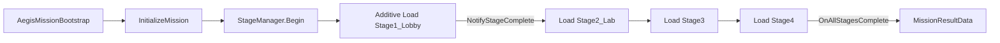

# 프로젝트: 이지스 (Project AEGIS)

Virtua Cop 스타일 **온레일 건슈팅** — 1인 개발, 약 **60분** 플레이 타임.  
단일 랜드마크 빌딩(넥사 코어 본사)을 층·구역별로 오르며 침투하는 구조입니다.

---

## 목차

1. [개요](#1-개요)
2. [세계관 및 미션](#2-세계관-및-미션)
3. [핵심 게임플레이](#3-핵심-게임플레이)
4. [스테이지 구성](#4-스테이지-구성)
5. [프로젝트 구조](#5-프로젝트-구조)
6. [핵심 시스템](#6-핵심-시스템)
7. [구현 규약](#7-구현-규약)
8. [개발 로드맵](#8-개발-로드맵)
9. [1인 개발 가이드](#9-1인-개발-가이드)
10. [시작하기](#10-시작하기)

---

## 1. 개요

| 항목 | 내용 |
|---|---|
| 장르 | 레일 슈터 (Light Gun / On-rails Shooter) |
| 엔진 | Unity 6 (6000.5) + URP |
| 플랫폼 | **PC** (마우스·키보드) + mi Core 미션 SDK 연동 |
| 개발 규모 | 1인, 4스테이지 / 총 60분 |
| 핵심 컨셉 | 하나의 거대 빌딩 안에서 층별 환경·적·기믹 차별화 |

---

## 2. 세계관 및 미션

**배경:** 가까운 미래. 거대 기술 기업 **넥사 코어(Nexa Core)** 가 개발한 치안 AI **이지스(AEGIS)** 가 테러집단에 해킹당해 도시를 위협합니다.

**주인공:** 대테러 특수부대 요원

**미션:** 넥사 코어 본사 빌딩에 단독 침투 → 해킹된 AI 메인프레임 무력화 → 인질 구출

---

## 3. 핵심 게임플레이

### 3.1 레일 진행 (Stop-and-Shoot)

```
[카메라 이동] → [컷 정지] → [적 처치 / 기믹 완료] → [다음 컷]
```

- 카메라는 **Cinemachine** 으로 미리 박힌 경로를 따라 이동합니다.
- 각 **컷(Cut)** 에서 레일이 멈추고, 플레이어는 조준·사격에 집중합니다.
- 웨이브 클리어(또는 타임아웃) 시 다음 VCam으로 전환합니다.

### 3.2 조준·사격

- 입력은 `IMissionInput` (mi Mission SDK)을 통해 레이캐스트 히트로 처리합니다.
- 적 조준 시 **마커 색상**으로 위협도를 표시합니다.

| 마커 | 의미 |
|---|---|
| 황색 | 경고 — 곧 사격 |
| 적색 | 발사 임박 — 즉시 처리 |
| 청색 | 충전 중 (드론·특수 무기) |

### 3.3 주요 기믹

| 기믹 | 설명 | 주요 스테이지 |
|---|---|---|
| 인질 구출 | `hostage_*` 콜라이더 오사 시 페널티 | 1 |
| 암전 기습 | 실루엣 0.5초 후 즉시 반응 | 2 |
| 파괴 오브젝티브 | 제한 시간 내 서버·폭탄 등 사격 파괴 | 3 |
| QTE 연타 | 보스 약점 노출 시 연속 명중 | 1, 3, 4 |
| 불릿 타임 | 고속 탄막 요격 (슬로우 모션) | 4 |

### 3.4 점수·페널티

`AegisMissionController` 가 `ScoreEventType` 기준으로 점수를 집계합니다.

| 이벤트 | 점수 |
|---|---|
| TargetHit | +100 |
| Combo (3연속+) | +50 |
| TimeBonus (스테이지 클리어) | +200 |
| ObjectiveComplete (보스 파츠 등) | +500 |
| Penalty (인질 오사 등) | -150 |

### 3.5 PC 조작 (마우스·키보드)

> 모든 씬 Play 모드에서 **F1** 또는 **H** 로 화면 하단 도움말을 켜고 끌 수 있습니다.  
> `AegisPlayModeServices` 가 자동으로 로드되며, 에디터에서 스테이지 씬을 단독 실행하면 미션 셸을 자동 부트스트랩합니다.

#### 공통 (모든 씬)

| 동작 | 입력 |
|---|---|
| 단축키 도움말 | **F1** / **H** |
| 씬 다시 시작 | **R** |
| 브리핑으로 (미션·스테이지) | **Esc** |

#### 미션 브리핑 (`Mission Briefing.unity`)

| 동작 | 입력 |
|---|---|
| 텍스트 스킵 | **Space** (타이핑 중) |
| 미션 수락 | **Enter** / **Space** (수락 가능 시) / **ACCEPT MISSION** 클릭 |
| 브리핑 재시작 | **Esc** |
| 카메라 경로 미리보기 재생/정지 | **P** |
| 경로 미리보기 처음으로 | **0** |

#### 미션·스테이지 (사격)

| 동작 | 입력 |
|---|---|
| 사격 / 조준 히트 | **마우스 좌클릭** (커서 위치) / **Space** (화면 중앙) |
| 스테이지 스킵 (디버그) | **N** |
| Stage1 컷 점프 | **1** ~ **7** |
| 이전 / 다음 컷 | **[** / **]** |
| 카메라 타임라인 토글 (Stage1) | **T** |

#### 씬별 실행

| 목적 | 열 씬 | Play 후 |
|---|---|---|
| 정식 플로우 | `Mission Briefing.unity` | Accept → `AegisMissionFull` |
| Stage1 단독 | `Stage1_Lobby.unity` | 사격·컷 테스트 (미션 셸 포함) |
| Stage2~4 단독 | `StageN_*.unity` | 에디터에서 미션 셸 자동 생성 |
| 4스테이지 통합 | `AegisMissionFull.unity` | Stage1부터 순차 additive |

씬에 미션 셸이 없으면 Unity 메뉴 **Aegis → Ensure PC Play Setup In All Scenes** 를 한 번 실행하세요.

---

## 4. 스테이지 구성

### 4.1 한눈에 보기

| # | 이름 | 장소 | 시간 | 보스 | 상세 문서 |
|---|---|---|---|---|---|
| 1 | 로비 침투 | 1층 로비 | 12분 | APC | [stage1_lobby.md](docs/stages/stage1_lobby.md) |
| 2 | 연구실의 비밀 | 지하 연구실 | 15분 | RX-7 | [stage2_lab.md](docs/stages/stage2_lab.md) |
| 3 | 데이터 센터 돌파 | 서버룸 | 13분 | 오버로드 | [stage3_datacenter.md](docs/stages/stage3_datacenter.md) |
| 4 | 최상층 & 코어 | 펜트하우스 → 코어 | 20분 | 수장 + 이지스 | [stage4_core.md](docs/stages/stage4_core.md) |

### 4.2 문서 역할 구분

| 문서 | 용도 | 대상 |
|---|---|---|
| `docs/stages/stageN_*.md` | 웨이브·보스·기믹 **기획** (연출, 내러티브, AI 행동) | 기획·연출 |
| [docs/design/scene_flow.md](docs/design/scene_flow.md) | **씬·스테이지 전환** 흐름 (브리핑 → 미션 → additive 스테이지) | 프로그래밍 |
| [docs/design/cut_timeline.md](docs/design/cut_timeline.md) | 컷별 **타임코드·VCam·스폰 슬롯** (구현 스펙) | 프로그래밍·레벨 |
| 이 README | 프로젝트 개요·아키텍처·규약 | 전체 |

> **컷(Cut)** = 카메라 1샷 + 스폰 트리거 1세트. **웨이브(Wave)** = 컷 안의 적 등장 묶음.  
> Stage 1은 컷 타임라인이 `Stage1CameraController` 에 이미 반영되어 있습니다.

### 4.3 난이도 곡선

```
Stage 1 ──► Stage 2 ──► Stage 3 ──► Stage 4
  튜토리얼     기습·갑옷      시간제한 기믹    엘리트 물량 + 2단 보스
  인질 도입    사이보그       환경 시야 방해   불릿 타임·QTE 클라이맥스
```

---

## 5. 프로젝트 구조

```
mi-aegis/
├── README.md                 # 이 파일
├── docs/
│   ├── stages/               # 스테이지별 기획서 (웨이브·보스·기믹)
│   └── design/
│       ├── scene_flow.md     # 씬·스테이지 전환 흐름
│       └── cut_timeline.md   # 컷 타임라인 구현 스펙
└── aegis/                    # Unity 프로젝트
    ├── Assets/
    │   ├── Missions/         # 미션 런타임·에디터
    │   │   ├── Runtime/      # StageManager, AegisMissionController 등
    │   │   └── Prefabs/      # AegisMission.prefab
    │   ├── MissionSDK/       # mi Core SDK 인터페이스
    │   ├── Scenes/
    │   │   ├── Stages/         # Stage1~4 스테이지 씬 (편집 + Stage1 플레이)
    │   │   ├── AegisMissionFull.unity
    │   ├── Prefabs/BuildingKit/  # 스테이지별 모듈형 건물 키트
    │   └── AddressableAssetsData/  # 스테이지 Addressables 그룹
    └── Packages/manifest.json
```

### 주요 패키지

| 패키지 | 용도 |
|---|---|
| Cinemachine 3 | 레일 카메라·VCam 전환 |
| Input System | 디버그 입력·SDK 입력 |
| Addressables | 스테이지 에셋 번들 |
| URP 17 | 렌더링 |
| ProBuilder | 블로킹·레벨 프로토타입 |
| Timeline | 컷씬·연출 시퀀스 |

---

## 6. 핵심 시스템

### 6.1 미션 루프



- `AegisMission.prefab`: **미션 셸만** 포함 (`AegisMissionController` + `StageManager`). 스테이지 지오메트리는 없음.
- `StageManager`: Addressables로 스테이지 씬을 **additive load** → 클리어 시 unload → 다음 스테이지 로드.
- 에디터 Play 모드: Addressables 빌드 없이 `editorScenePaths`로 `Assets/Scenes/Stages/*.unity`를 직접 로드.
- `StageRoot`: 각 스테이지 씬 루트에 배치. `FindAnyObjectByType<StageManager>()`로 연결.

### 6.2 씬 역할

> 전체 진입·전환 흐름은 [`docs/design/scene_flow.md`](docs/design/scene_flow.md) 참고.

| 씬 | 용도 |
|---|---|
| `Assets/Scenes/Mission Briefing.unity` | **앱 시작** — 브리핑 UI. Accept → `AegisMissionFull` 로드 |
| `Assets/Scenes/AegisMissionFull.unity` | **4스테이지 통합** 미션 셸 (StageManager가 스테이지 additive 로드) |
| `Assets/Scenes/Stages/Stage1_Lobby.unity` | **Stage1** 편집 + 단독 플레이 테스트 (미션 셸·Bootstrap 포함) |

1. `Assets/Scenes/Stages/StageN_*.unity` 를 열어 해당 스테이지만 편집합니다.
2. 컷마다 빈 오브젝트 `Cut_1_1`, `Cut_1_2` … 하위에 스폰 포인트 배치
3. 스폰 슬롯 네이밍: `spawn_L_far`, `spawn_C_near` 등 (L/C/R × far/near)
4. 적 프리팹 콜라이더 이름 = `targetId` (점수 로그에 기록)
5. 웨이브 클리어 조건 → 다음 VCam Priority 상승 또는 Timeline 시그널

### 6.3 카메라 (Stage 1 참고 구현)

`Stage1CameraController` 패턴:

| 컷 | VCam 이름 | 시작 시각(초) |
|---|---|---|
| 1-1 | Vcam_1_1_Entrance | 0 |
| 1-2 | Vcam_1_2_Reception | 80 |
| 1-3 | Vcam_1_3_Balcony | 160 |
| 1-4 | Vcam_1_4_Corridor | 260 |
| 1-5 | Vcam_1_5_ElevatorLobby | 340 |
| 1-6 | Vcam_1_6_ParkingLot | 440 |
| 1-7 | Vcam_1_7_Boss | 520 |

Stage 2~4도 동일 패턴으로 `StageNCameraController` 를 추가합니다.

---

## 7. 구현 규약

### 7.1 콜라이더·오브젝트 네이밍

| 접두사 | 용도 | SDK 이벤트 |
|---|---|---|
| (일반 적 이름) | 적 본체 | TargetHit |
| `hostage_*` | 인질 | Penalty (오사 시) |
| `boss_*` | 보스 파츠·약점 | ObjectiveComplete |
| `objective_*` | 서버·폭탄 등 파괴 대상 | ObjectiveComplete |
| `spawn_*` | 스폰 포인트 (히트 대상 아님) | – |

### 7.2 적 타입 정의

| 타입 | 체력 | 행동 | 약점 |
|---|---|---|---|
| 그런트 | 1~2히트 | 엄폐 후 사격, 팝업 등장 | 일반 |
| 방패병 | 3히트 | 정면 실드 | 측면·다리 |
| 저격병 | 1히트 | 원경, 레이저 조준선 후 발사 | 조준 중 |
| 드론 | 1히트 | 공중 이동, 급강하 | 코어(붉은 빛) |
| 사이보그 | 2~3히트 | 경장갑 | 팔·등 코어 |
| 엘리트 | 2히트 | 빠른 회피·높은 탄속 | 착지 순간 |

### 7.3 스폰 슬롯 좌표계

화면 정면 기준:

```
        [원경 L]     [원경 C]     [원경 R]
        [근경 L]     [근경 C]     [근경 R]
```

스폰 트리거는 `OnCutEnter` 시 활성화, `OnWaveClear` 시 비활성화합니다.

### 7.4 레이어

- `targetLayer` (AegisMissionController): 사격 가능 대상만 포함
- 인질·배경·스폰 포인트는 별도 레이어로 분리

---

## 8. 개발 로드맵

| 단계 | 목표 | 산출물 |
|---|---|---|
| **M0 프로토타입** | Stage 1 컷 1~2, 히트·점수 동작 | Playable Cut 1-1, 1-2 |
| **M1 수직 슬라이스** | Stage 1 전체 + APC 보스 | Stage1_Lobby.unity 완성 |
| **M2 콘텐츠 확장** | Stage 2~3, 기믹 시스템 | 인질·타이머 오브젝티브 |
| **M3 폴리시** | Stage 4, BGM·VFX·UI | 60분 풀 플레이 |
| **M4 SDK 연동** | mi Core 빌드·점수 리포트 | Addressables 빌드 파이프라인 |

각 마일스톤 완료 기준: 해당 스테이지를 처음부터 끝까지 플레이 가능 + 크래시 없음.

---

## 9. 1인 개발 가이드

### 에셋 재활용

- **BuildingKit** (`Prefabs/BuildingKit/Stage1Lobby/` 등) 모듈을 층별로 변형·재배치
- 사무실 / SF / 사이버펑크 에셋 팩 1~2개로 통일감 유지
- 적 메시는 3~4종 + 머티리얼 스왑으로 엘리트·사이보그 표현

### 카메라·레일

- Cinemachine Camera + Dolly/Spline으로 경로를 먼저 깔고, **컷 경계에 Pause 포인트** 배치
- 연출 전용 컷(셔터 개방, 보스 등장)은 Timeline Signal로 VCam 전환
- `StageCameraPathPreview` 로 미션 브리핑 UI에서 경로 미리보기

### 적 AI 단순화

- NavMesh·순찰 AI 불필요 — **등장 애니메이션 + 사격 타이머** 로 충분
- 상태: `Hidden → Aiming → Firing → Dead` (4-state FSM)
- 보스만 페이즈별 스크립트 (`BossApcController` 등) 분리

### 우선순위

1. **플레이 느낌** (조준·히트 피드백·마커) → 2. **카메라 템포** → 3. **비주얼 폴리시**

### 하지 말 것 (스코프 방지)

- 자유 이동·커버 슈팅 메커닉 추가
- 스테이지마다 완전히 다른 무기 시스템
- 멀티플레이·PvP

---

## 10. 시작하기

### 요구 사항

- Unity **6000.5.2f1** 이상
- macOS / Windows (현재 Addressables 빌드 타깃: OSX 그룹 존재)

### 실행

1. Unity Hub에서 `aegis/` 폴더를 프로젝트로 엽니다.
2. **정식 플로우:** `Assets/Scenes/Mission Briefing.unity` → Play → **Enter** / **Space** / **ACCEPT MISSION** 클릭.
3. **Stage1 작업/테스트:** `Assets/Scenes/Stages/Stage1_Lobby.unity` → Play (**마우스 좌클릭** 사격, **N** 스테이지 스킵).
4. **전체 미션 테스트:** `Assets/Scenes/AegisMissionFull.unity` → Play.
5. **Stage1 비주얼 재적용:** **Aegis → Apply Stage1 Lobby Visuals** 또는 **Build Stage1 Lobby Exterior**.
6. **Stage1 내부 구조(2층 발코니·엘리베이터·주차장):** **Aegis → Build Stage1 Lobby Architecture**.
7. **PC 조작·미션 셸 일괄 설정:** **Aegis → Ensure PC Play Setup In All Scenes** (최초 1회 권장).
8. Stage1 컷/카메라 재설정: **Aegis → Setup Stage1 Lobby Play Scene**.

단축키 전체 목록은 [§3.5 PC 조작](#35-pc-조작-마우스키보드)을 참고하세요.

### 관련 스크립트 진입점

| 스크립트 | 역할 |
|---|---|
| `AegisMissionBootstrap` | 미션 초기화 진입점 |
| `AegisMissionController` | 점수·히트·종료 |
| `StageManager` | 스테이지 순환 |
| `Stage1CameraController` | Stage 1 VCam 타임라인 |
| `MissionBriefingController` | 브리핑 UI |
| `AegisPlayModeServices` | 전역 PC 단축키·도움말 오버레이 |
| `AegisPcControls` | 단축키 상수 (README §3.5) |
| `DebugMissionInput` | PC 사격 입력 (마우스·Space) |

---

## 라이선스 / 크레딧

(추가 예정)
