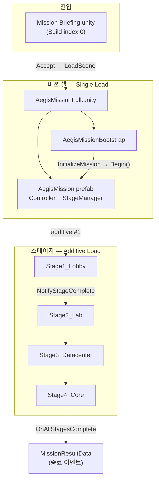

# 씬 흐름 (Scene Flow)

> mi-aegis 단독 실행(에디터·빌드)과 mi Core 연동 시의 씬·스테이지 전환을 정리합니다.  
> 스테이지 **내부** 컷·카메라·스폰 상세는 [`cut_timeline.md`](cut_timeline.md), 스테이지별 기획은 [`docs/stages/`](../stages/)를 참고하세요.

---

## 1. 한눈에 보기



| 단계 | 씬 / 오브젝트 | 로드 방식 | 담당 코드 |
|------|----------------|-----------|-----------|
| 1 | `Mission Briefing.unity` | 앱 시작 (Build Settings index 0) | `MissionBriefingController` |
| 2 | `AegisMissionFull.unity` | `SceneManager.LoadScene` (Single, 브리핑 교체) | `MissionBriefingController.nextSceneName` |
| 3 | 미션 셸 (`AegisMission` + Bootstrap) | 미션 씬에 배치 | `AegisMissionBootstrap` |
| 4 | `Stage1_Lobby` … `Stage4_Core` | **Additive** (한 번에 하나) | `StageManager` |
| 5 | (미구현) 결과·로비 복귀 | — | `OnMissionEnded` 구독자 |

---

## 2. 브리핑 → 미션 시작

### `Mission Briefing.unity`

- **역할:** 스토리 텍스트 타입라이터 + Accept / Reject UI.
- **시작 씬:** `EditorBuildSettings`에 index 0으로 등록.
- **Accept 시:** `MissionBriefingController.LoadNext()` → `SceneManager.LoadScene(nextSceneName)`.
- **설정값:** Inspector `nextSceneName` = `AegisMissionFull` (씬 파일명, 확장자 제외).

Reject는 현재 브리핑만 재시작합니다 (로비 복귀 없음).

### `AegisMissionFull.unity`

- **역할:** 4스테이지 통합 플레이용 **미션 셸 씬** (지오메트리 없음).
- **포함 오브젝트:**
  - `Main Camera` + `CinemachineBrain`
  - `AegisMission` — `AegisMissionController` + `StageManager` (4스테이지 주소 전체)
  - `AegisMissionBootstrap` — `DebugMissionInput`으로 미션 자동 시작
- **Build Settings:** index 1 (`Mission Briefing` 다음).

> **주의:** `SceneManager.LoadScene`은 Build Settings에 등록된 씬만 로드할 수 있습니다. `AegisMissionFull`을 빌드에 넣지 않으면 Accept 후 오류가 납니다.

---

## 3. 미션 셸 안에서 일어나는 일

### 3.1 부트스트랩 (`AegisMissionBootstrap.Start`)

1. `MissionContext` 생성 (`DebugMissionInput`, 난이도·시간 제한 등).
2. `AegisMissionController.InitializeMission(userData, context)` 호출.
3. `StageManager.Begin()` → 첫 스테이지 additive 로드 시작.

### 3.2 스테이지 순환 (`StageManager`)

```
Begin / NotifyStageComplete
  → 이전 스테이지 씬 unload (embedded 제외)
  → index++
  → index >= 4 이면 OnAllStagesComplete
  → 아니면 stageSceneAddresses[index] 로드 (additive)
  → OnStageStarted(index)
```

| Index | Addressables 주소 | 에디터 경로 | 씬 이름 |
|-------|-------------------|-------------|---------|
| 0 | `stage/1_lobby` | `Assets/Scenes/Stages/Stage1_Lobby.unity` | `Stage1_Lobby` |
| 1 | `stage/2_lab` | `Assets/Scenes/Stages/Stage2_Lab.unity` | `Stage2_Lab` |
| 2 | `stage/3_datacenter` | `Assets/Scenes/Stages/Stage3_Datacenter.unity` | `Stage3_Datacenter` |
| 3 | `stage/4_core` | `Assets/Scenes/Stages/Stage4_Core.unity` | `Stage4_Core` |

- **에디터 Play:** `useEditorScenePathsInPlayMode`가 켜져 있으면 Addressables 빌드 없이 `editorScenePaths`로 직접 로드.
- **빌드 / mi Core:** Addressables `LoadSceneAsync`로 additive 로드.

### 3.3 스테이지 클리어 (`StageRoot`)

각 스테이지 씬 루트의 `StageRoot`가 `StageManager`를 찾아 연결합니다.

- **디버그:** 키 `N` → `NotifyStageComplete()` (다음 스테이지로 진행).
- **자동:** `autoCompleteOnAllTargetsDisabled`가 켜져 있으면 모든 타겟 콜라이더 비활성 시 완료.

Stage1 실제 웨이브·보스 클리어 조건은 아직 컷 시스템과 부분 연동 상태입니다. 상세 타임라인은 [`cut_timeline.md`](cut_timeline.md).

### 3.4 스테이지 내부 (Stage 1 예시)

`Stage1_Lobby` 안에서:

- `Environment_Stage1_Lobby` — BuildingKit 로비 지형
- `CameraPath_Stage1` — Cinemachine VCam 7개
- `Stage1_Cuts` — 컷별 스폰·트리거
- `Stage1CameraController` — 타임라인 기반 VCam 전환 (테스트용)

Stage 2~4는 플레이스홀더 위주. 기획은 `docs/stages/stageN_*.md`.

### 3.5 미션 종료

- **성공:** 4스테이지 모두 클리어 → `StageManager.OnAllStagesComplete` → `AegisMissionController.Finish(true)` → `OnMissionEnded`.
- **실패:** `timeLimitSeconds` 초과 → `Finish(false)`.
- **현재:** `AegisMissionBootstrap`이 `Debug.Log`만 출력. **결과 화면 씬·브리핑 복귀는 미구현.**

---

## 4. 개발용 단축 경로

에디터에서 전체 브리핑 없이 테스트할 때:

| 열 씬 | 동작 |
|--------|------|
| `Stage1_Lobby.unity` | 미션 셸 + Bootstrap + Stage1이 **같은 씬**에 있음 → `StageManager` **embedded** 모드 (Stage1 중복 로드 안 함). Stage1만 주소에 등록됨. |
| `AegisMissionFull.unity` | 4스테이지 순차 additive 로드 (본편과 동일). |
| `Mission Briefing.unity` | Play → Accept → `AegisMissionFull` (의도된 본편 진입). |

메뉴:

- **Aegis → Setup Stage1 Lobby Play Scene** — Stage1 단독 플레이 씬 구성
- **Aegis → Repair Stage1 Lobby Scene** — 깨진 프리팹·환경 복구

---

## 5. mi Core 연동 시 (참고)

mi 앱에서는 브리핑·미션 선택이 **mi 로비**에서 이뤄질 수 있습니다. 이 경우 `Mission Briefing.unity`를 거치지 않고:

1. mi 로비에서 `aegis_rail_shooter` 번들 선택
2. `MissionBundleLoader`가 `AegisMission` 프리팹 인스턴스화
3. mi Core가 `MissionContext`(BDS 입력 등) 주입 후 `InitializeMission`
4. 이후 흐름은 **§3와 동일** (StageManager additive)

자세한 연동은 [`MI-COMMON.md`](../../MI-COMMON.md) §2·§3.

---

## 6. 관련 파일

| 파일 | 역할 |
|------|------|
| `Assets/Scripts/MissionBriefing/MissionBriefingController.cs` | 브리핑 UI → 다음 씬 로드 |
| `Assets/Missions/Runtime/AegisMissionBootstrap.cs` | 미션 자동 시작 (단독 테스트) |
| `Assets/Missions/Runtime/AegisMissionController.cs` | 점수·입력·종료 |
| `Assets/Missions/Runtime/StageManager.cs` | 스테이지 additive 순환 |
| `Assets/Missions/Runtime/StageSceneAddresses.cs` | 주소·에디터 경로 상수 |
| `Assets/Missions/Runtime/StageRoot.cs` | 스테이지 완료 신호 |
| `ProjectSettings/EditorBuildSettings.asset` | 빌드에 포함할 씬 목록 |

---

## 7. 로드맵 (씬 흐름)

- [ ] 미션 결과 UI 씬 + `OnMissionEnded` 후 `LoadScene`
- [ ] Stage1 웨이브 클리어 → `NotifyStageComplete` 자동 연동
- [ ] mi Core 로비와 `Mission Briefing` 중 하나로 진입 경로 통일
