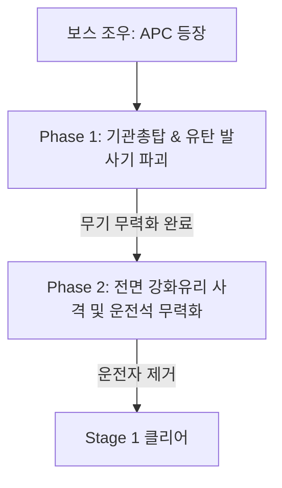

# Stage 1: 로비 침투 (Under Attack)

## 1. 스테이지 개요
* **장소:** 넥사 코어 빌딩 1층 중앙 로비 및 인포메이션 데스크
* **환경/분위기:** 대리석으로 마감된 현대적이고 고급스러운 로비. 테러 공격으로 파괴된 인테리어, 천장에서 쏟아지는 불꽃 스파크, 비상 경보등(붉은색)이 점멸하며 긴박감을 연출.
* **플레이 타임:** 약 12분
* **배경음악:** 빠른 템포의 일렉트로닉 락/오케스트라 하이브리드 비트 (긴장감 고조)

---

## 2. 카메라 이동 동선 (레일 경로)
```
[진입로 (회전문)] ──> [중앙 로비 (기둥 구역)] ──> [안내 데스크 (인질 구역)] ──> [엘리베이터 홀 (보스 광장)]
```
1. **진입 시퀀스:** 회전문이 폭발하며 카메라가 로비 내부로 강하고 빠르게 진입.
2. **엄폐 사격 시퀀스:** 거대한 대리석 기둥들 사이를 지그재그로 이동하며, 기둥 뒤에 숨은 적들을 사격.
3. **데스크 돌파 시퀀스:** 안내 데스크 위를 슬라이딩하듯 저공 비행하는 카메라 앵글. 안내 데스크 뒤에 엎드린 인질과 테러리스트 무리를 비춤.
4. **보스 조우 시퀀스:** 유리창을 깨고 진입하는 무장 전술 장갑차(APC)를 향해 앙글(Low Angle)로 카메라가 고정됨.

---

## 3. 에너미 스폰 및 웨이브 (Spawn Waves)

### **Wave 1: 회전문 & 중앙 로비 진입**
* **상황:** 플레이어가 부서진 회전문을 통과해 진입하자마자 로비 안쪽에 대기하던 적들이 사격 개시.
* **배치:**
  * **일반 테러리스트 A, B (정면):** 로비 쓰레기통 및 소파 뒤에 대기 후 사격 (약 3초 뒤 발사).
  * **드론 1기 (공중):** 중앙 샹들리에 부근에서 하강하며 붉은 조준선을 조준.
* **타겟 마커 색상:** 
  * 일반 테러리스트: 황색 (경고) -> 적색 (발사 임박)
  * 드론: 청색 (충전 중) -> 적색 (레이저 발사)

### **Wave 2: 대리석 기둥 우회 (기습 및 오사 주의)**
* **상황:** 카메라가 우측 대리석 기둥을 돌 때, 적이 인질을 방패막이로 삼고 등장하거나 기둥 위층 난간에서 기습 사격.
* **배치:**
  * **인질 A (민간인):** "살려주세요!" 외치며 화면 좌측에서 우측으로 달아남.
  * **테러리스트 C (기둥 뒤):** 인질 바로 뒤에서 나타나 사격 조준. (플레이어는 인질을 피해서 적만 맞춰야 함)
  * **테러리스트 D (2층 난간):** 위에서 아래로 저격 소총 조준. (가장 먼저 처리하지 않으면 큰 피해)

### **Wave 3: 안내 데스크 (인질 구출)**
* **상황:** 안내 데스크 뒤에 숨어있는 테러리스트들과 붙잡힌 인질들.
* **배치:**
  * **인질 B (안내원):** 데스크 뒤에 묶여 있음.
  * **테러리스트 E (인질 협박):** 인질의 머리 뒤에 총을 겨누고 있음. 2.5초 내에 머리 또는 노출된 어깨 부위를 정확히 사격하지 않으면 인질 처형 (패널티 발생).
  * **일반 테러리스트 F, G:** 안내 데스크 좌우에서 엄폐 사격.

---

## 4. 기믹 및 시스템 상세

### **인질 구출 시스템 (Hostage Rescue)**
* **오사 패널티:** 인질을 실수로 맞출 경우 플레이어 체력(Life) 1칸 즉시 차감 및 최종 랭크 점수 감점.
* **완벽 구출 보상:** 인질을 위협하는 적을 헤드샷이나 약점 사격으로 신속히 제거해 구출 성공 시, 체력 회복 아이템(구급상자) 또는 보너스 점수 획득.

### **드론 사격 메커니즘**
* 드론은 체력이 낮으나 회피 기동을 함.
* 조준 중일 때 중심의 '코어(붉은 빛)'를 맞추면 1격에 파괴 가능(원샷 킬).

---

## 5. 보스전: 무장 전술 장갑차 (APC)
로비 뒤편 유리창을 깨고 들어와 엘리베이터 앞 광장을 가로막는 검은색 대형 장갑차.



### **Phase 1: 포탑 및 무장 파괴**
* **기관총탑 (좌측):** 플레이어를 향해 연사 사격을 가함. 탄환 비행 궤적이 화면에 선으로 표시됨. 날아오는 총탄을 사격해서 튕겨내거나(패링 사격), 포탑 자체를 지속 사격하여 파괴.
* **유탄 발사기 (우측):** 공중으로 3개의 유탄을 발사. 유탄은 화면을 향해 날아오는 궤적을 그리며 붉은 원형 록온 마커가 표시됨. 폭발하기 전(화면에 닿기 전) 사격하여 공중 격추해야 함.

### **Phase 2: 운전석 무력화**
* 무장이 모두 파괴되면 APC가 충돌 돌진(Ramming) 패턴을 시작함.
* 전면 앞유리의 방탄강화 플라스틱 커버가 노출됨.
* 돌진해오는 짧은 순간(약 4초) 동안 전면 유리창의 약점(붉은 점)을 점사하여 균열을 내고, 유리를 관통시켜 안쪽의 운전수를 사격하면 승리.

---

## 6. 개발 단계 구현 팁 (Unity/Unreal 등)
* **카메라 동선 제어:** Spline(또는 Cinemachine Dolly Cart)을 이용해 카메라 경로를 미리 구워두고, 특정 웨이브 존(Spawn Trigger)에 진입하면 카트의 속도를 0으로 만들어 멈춘 뒤, 모든 적이 죽거나 시간 초과 시 다음 노드로 다시 가속하여 이동.
* **마커 연출:** 적이 조준하는 속도에 맞춰 마커의 스케일이 1.0에서 0.0으로 작아지며 색상이 적색으로 변하도록 셰이더/UI 애니메이션 구성.
