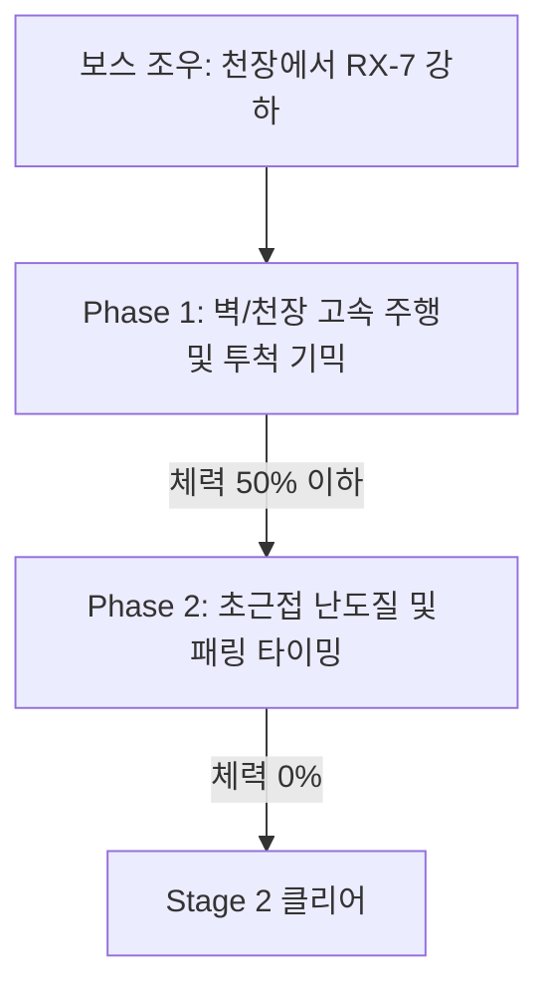

# Stage 2: 연구실의 비밀 (The Server Lab)

## 1. 스테이지 개요
* **장소:** 넥사 코어 빌딩 25층 중환자 및 생체 로봇 연구소
* **환경/분위기:** SF 스타일의 차가운 실험실 복도와 어두운 생체 실험 공간. 깨진 배양 탱크에서 새어 나오는 에메랄드빛 액체, 불규칙하게 점멸하는 천장 형광등으로 인해 스릴러 분위기가 연출됨.
* **플레이 타임:** 약 15분
* **배경음악:** 긴장감을 조성하는 엠비언트 테크노 및 불협화음의 기계음 효과음 조합

---

## 2. 카메라 이동 동선 (레일 경로)
```
[실험실 복도] ──> [어두운 기습 연구실] ──> [배양 탱크 대형 홀] ──> [메인 제어 컴퓨터실]
```
1. **서행 시퀀스:** 카메라가 복도 코너를 아주 천천히 돌며 경계 태세를 취함. 모퉁이 너머에서 깜빡이는 불빛 아래 적의 그림자가 보임.
2. **점멸 시퀀스:** 기습 연구실 진입 후 전등이 완전히 꺼졌다가 켜지기를 반복. 전등이 꺼졌을 때 적들의 붉은 안광이 어둠 속에서 다가오는 모습 연출.
3. **앙글 줌 시퀀스:** 배양 탱크 홀에 진입 시 거대한 탱크들이 좌우로 배치되어 있으며, 탱크 사이에서 방패병이 기어 나오는 모습에 카메라가 클로즈업 줌인됨.
4. **보스 조우 시퀀스:** 보스가 천장에서 바닥으로 떨어지며 카메라 렌즈를 향해 포효하는 연출.

---

## 3. 에너미 스폰 및 웨이브 (Spawn Waves)

### **Wave 1: 복도 코너 클리어링**
* **상황:** 양옆 연구원 사무실 문이 부서지며 경비 로봇들과 기초 사이보그가 튀어나옴.
* **배치:**
  * **일반 사이보그 A, B:** 사격 무기 대신 기계 손톱으로 돌진해오는 근접형 적. 화면에 도달하기 전 사격하여 저지(화면에 도달하면 즉시 공격 판정).
  * **경비 드론 (정면 저 멀리):** 복도 끝에서 플레이어를 향해 서서히 전진하며 사격.

### **Wave 2: 어둠 속의 기습 (점멸 기믹)**
* **상황:** 연구실 내부 조명이 2초 주기로 소등/점등됨. 소등되었을 때는 조준선 마커가 사라지고 안광(붉은 점)만 표시됨.
* **배치:**
  * **고속 사이보그 C, D:** 벽과 천장을 지그재그로 뛰어다니며 접근. 점등되었을 때 위치를 파악하고, 소등되었을 때 예상 이동 경로의 안광을 사격해야 함.
  * **일반 테러리스트 (보초):** 소등 상태에서도 손전등 빛을 비추며 플레이어를 조준. 손전등 빛을 가이드 삼아 역조준 사격 가능.

### **Wave 3: 배양 탱크 대형 홀 (방패병 등장)**
* **상황:** 물리적인 공격을 무효화하는 거대 방패를 든 특수 사이보그 등장.
* **배치:**
  * **방패 사이보그 (Shield Cyborg):** 정면에서 커다란 진압 방패로 몸을 가린 채 천천히 다가옴.
  * **일반 테러리스트 E, F:** 방패 사이보그 좌우에서 지원 사격.

---

## 4. 기믹 및 시스템 상세

### **방패병 공략 메커니즘 (Shield Enemy Mechanic)**
* **일반 사격 시:** 방패에 맞으면 도탄 이펙트가 발생하며 대미지가 들어가지 않음.
* **약점 공략:**
  1. **노출 부위 사격:** 방패 사이로 가끔 노출되는 **무릎**이나 **어깨** 부위를 정밀 사격하여 자세를 흩트림.
  2. **조인트 사격:** 방패 우측 상단의 **배터리 조인트(노란색 빛)**를 3회 연속 타격하면 방패 전기 장치가 과부하되어 방패가 파괴되거나 떨어뜨림.
  3. **자세 제어 상실:** 다리를 쏘아 자세가 무너지면(Stagger) 방패를 아래로 내리게 되며, 이때 노출되는 헤드를 쏘아 즉사시킬 수 있음.

---

## 5. 보스전: 프로토타입 사이보그 'RX-7'
동물적인 민첩함과 고성능 기계 의체를 갖춘 인간형 실험 병기.



### **Phase 1: 고속 이동 및 투척 패턴**
* **벽/천장 이동:** RX-7이 방 안의 벽과 기둥, 천장을 빠른 속도로 도약하며 이동함. 이동 중에는 잔상이 남아 사격이 매우 어려움.
* **사격 찬스 (Stall):** 벽에 착지한 뒤 플레이어를 향해 산성 액체나 칼날을 던지려고 약 1.5초간 자세를 취함. 이때 보스 머리 위에 나타나는 약점 마커를 조준 사격하면 뒤로 자빠지며 큰 그로기 대미지를 입음.
* **투척물 격추:** 보스가 던지는 날카로운 부품들을 공중에서 사격하여 격추시켜 피해를 무효화해야 함.

### **Phase 2: 초근접 난무 패턴**
* RX-7의 안광이 청색에서 과부하된 보라색으로 변하며 폭주함. 벽 이동을 멈추고 바닥에서 플레이어를 향해 지그재그로 슬라이딩 돌진함.
* **난무 패링 사격:** 보스가 플레이어 화면 바로 앞까지 접근하여 3단 연속 베기를 가함. 베기 액션이 시작될 때 화면 중앙에 순간적으로 나타나는 **"BREAK" 마커(약 0.5초 노출)**를 리듬 게임처럼 타이밍에 맞춰 격발해야 함.
* 3번의 BREAK 사격을 모두 성공하면 보스가 대경직에 빠지며 헤드에 크리티컬 데미지를 넣을 수 있는 찬스가 주어짐. 1번이라도 실패 시 큰 데미지를 입고 뒤로 밀려남.

---

## 6. 개발 단계 구현 팁
* **안광(Emissive) 연출:** 어두운 맵에서 적들의 붉은 눈빛이 도드라지도록 HDR 렌즈 플레어 및 포스트 프로세싱 블룸(Bloom) 효과를 강하게 설정.
* **BREAK 패링 마커:** 보스의 공격 프레임과 UI 마커 애니메이션을 동기화하여 플레이어가 직관적으로 타이밍을 잡을 수 있게 오디오 큐(칭! 하는 금속음)와 UI 크기 연출을 매칭.
