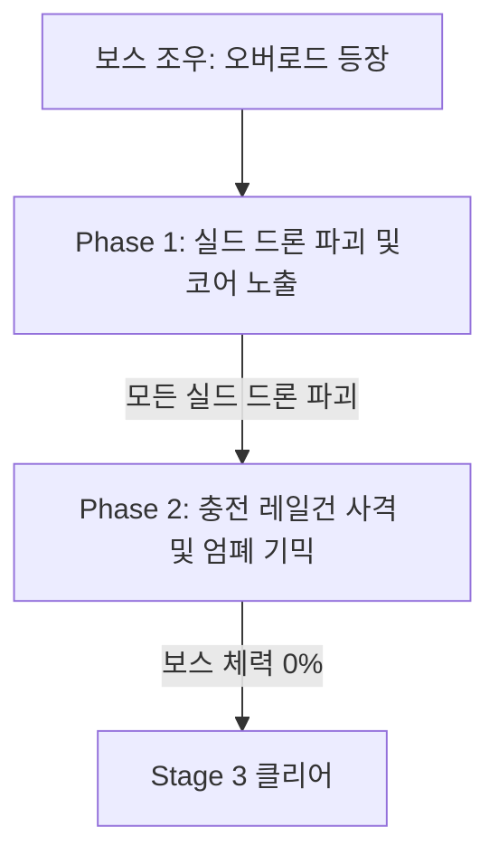

# Stage 3: 데이터 센터 돌파 (Server Room Hub)

## 1. 스테이지 개요
* **장소:** 넥사 코어 빌딩 50층 대규모 서버실 및 전력 제어소
* **환경/분위기:** 수천 개의 서버 랙이 늘어선 대규모 데이터 센터. 테러리스트들의 폭파 시도로 냉각 가스 파이프가 터져 자욱한 백색 연기와 전기 스파크가 시야를 방해함. 기계 돌아가는 윙윙거리는 소리와 경고음이 귓가를 채움.
* **플레이 타임:** 약 13분
* **배경음악:** 긴장감 넘치는 사이버펑크 스타일의 다크 신스웨이브(Dark Synthwave)

---

## 2. 카메라 이동 동선 (레일 경로)
```
[서버 랙 복도 1구역] ──> [스팀/가스 분출 구역] ──> [중앙 제어 데스크] ──> [메인프레임 분기 룸]
```
1. **미로형 시퀀스:** 높은 서버 랙들 사이를 좌우로 급격히 회전하며 전진하는 카메라. 코너를 돌 때마다 근접 대기 중이던 적과 근거리 조우.
2. **시야 제한 시퀀스:** 가스 파이프가 터져 수증기가 뿜어져 나오는 구역. 카메라가 수증기 속으로 들어가며 시야가 뿌옇게 흐려짐.
3. **콘솔 고정 시퀀스:** 중앙 제어 데스크에 카메라가 멈추며, 벽면에 부착된 폭탄 장치를 사격 해체해야 하는 정지 사격 시퀀스.
4. **보스 조우 시퀀스:** 서버 랙들이 원형으로 둘러싸고 있는 센트럴 코어 룸에 도달하여 공중에 부양한 거대 드론을 올려다보는 카메라 앵글.

---

## 3. 에너미 스폰 및 웨이브 (Spawn Waves)

### **Wave 1: 연막 속의 유령 (스텔스 일반병)**
* **상황:** 자욱한 냉각 가스 연막 때문에 적의 외형이 불분명하게 실루엣으로만 보임.
* **배치:**
  * **광학 미채 테러리스트 A, B:** 투명 화질 상태로 숨어 있다가 총을 쏘기 직전(약 1.5초) 조준 마커가 뜨며 실루엣이 나타남. 나타나는 짧은 순간 사격하여 차단해야 함.
  * **드론:** 천장에서 와이어를 타고 하강하며 레이저 사격.

### **Wave 2: 연기 너머의 스나이퍼**
* **상황:** 연기가 꽉 차서 육안으로는 적이 보이지 않으나, 연기를 뚫고 들어오는 붉은색 스나이퍼 조준선(레이저 사이트)이 플레이어를 겨냥함.
* **배치:**
  * **저격수 C (연기 뒤 서버 랙 위 난간):** 레이저 사이트의 출발점을 역추적하여 조준선을 사격하거나, 카메라 스위치 기능(열감지 스코프 모드)을 켜서 적의 노란 발열 실루엣을 조준하여 제거.

### **Wave 3: 전력 제어 콘솔 (시한 폭탄 해체)**
* **상황:** 적의 사격 방해 속에서 15초 제한 시간 내에 전력 차단용 폭탄을 해체해야 함.
* **배치:**
  * **자폭 드론 2기:** 하늘에서 플레이어를 향해 빠른 속도로 돌격. 돌격해오기 전 제거 우선.
  * **일반 테러리스트 D, E:** 콘솔 양옆에서 엄폐 상태로 사격 방해.

---

## 4. 기믹 및 시스템 상세

### **시한 폭탄 해체 사격 메커니즘 (Bomb Defusal)**
* 플레이어가 중앙 콘솔에 도달하면 폭탄 장치 UI가 활성화되며 15초 카운트다운이 시작됨.
* 폭탄 장치에는 세 가지 색상의 전선 터미널 **[Red], [Blue], [Yellow]** 과 미니 액정 화면이 부착되어 있음.
* 화면에 무작위로 뜨는 해체 코드 순서(예: `Yellow -> Red -> Blue`)에 맞춰 해당 터미널을 정확히 단발 사격해야 함.
* **성공:** 제한 시간 내 순서대로 사격 시 폭탄 해체 완료 및 대량 보너스 점수.
* **실패:** 엉뚱한 색상을 사격하거나 제한 시간이 종료될 경우, 폭탄이 터져 플레이어 체력이 2칸 차감되고 다음 구역으로 강제 이동(폭파 잔해 연출).

---

## 5. 보스전: 이지스 보안 드론 '오버로드'
원형 메인프레임 룸을 지키는 대형 다각 보안 드론.



### **Phase 1: 보호막 링크 패턴**
* **실드 드론 4기 공전:** 오버로드 본체 주위에 소형 실드 드론 4기가 둥글게 돌며 무적 방어막을 형성함. 본체를 쏘면 도탄됨.
* **패턴 사격:** 실드 드론들은 제각기 플레이어를 향해 유도 에너지 볼트를 한 발씩 쏨. 날아오는 에너지 볼트를 공중 격추하면서 실드 드론 4기를 전부 파괴해야 보호막이 꺼짐.
* **코어 오픈:** 보호막이 꺼지면 보스 중심부의 '붉은 코어'가 5초간 노출됨. 이때 속사하여 피해를 극대화해야 함. 5초가 지나면 보스가 실드 드론 4기를 재소환함.

### **Phase 2: 충전 레일건 사격 & 환경 엄폐**
* 보스의 에너지가 충전되며 방 전체를 좌우로 가르는 대형 레일건 레이저를 충전함 (충전 시간 3.5초).
* **서버 랙 엄폐 기믹:** 화면 좌측 또는 우측에 '파괴 가능' 마킹이 있는 대형 서버 랙이 표시됨. 레이저 발사 직전 이 서버 랙의 지지대(붉은 마크)를 사격하여 플레이어 전면으로 무너뜨려야 함.
* 무너진 서버 랙 뒤로 카메라가 자동으로 엄폐(Ducking)하며 보스의 충전 레이저를 막아냄. 만약 서버 랙을 무너뜨리지 못하면 피할 수 없는 레이저에 맞아 체력이 크게 소모됨.

---

## 6. 개발 단계 구현 팁
* **열 감지 스코프 연출:** 화면 전체를 파란색 톤으로 덮고 적 캐릭터에 높은 Emissive 값을 가진 노란/빨간 마스크 셰이더를 입혀 연기 속에서도 보이도록 포스트 프로세스 머티리얼 구성.
* **서버 랙 파괴 물리 피직스:** 지지대 사격 시 `Rigidbody`를 활성화하여 물리 연산으로 무너지거나, 미리 애니메이션 레코딩된 FBX를 재생하여 안정적인 엄폐물 형성 연출 확보.
