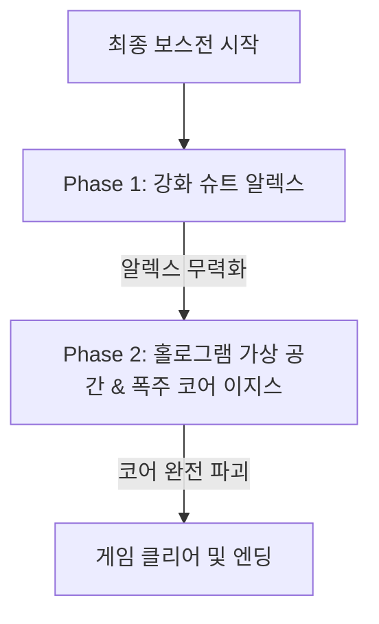

# Stage 4: 최상층 펜트하우스 & 코어 (The Final Core)

## 1. 스테이지 개요
* **장소:** 넥사 코어 빌딩 100층 최상층 회장실(펜트하우스) 및 지하 AI 메인프레임 가상 코어 룸
* **환경/분위기:** 화려한 미래 도시의 야경이 내려다보이는 초호화 펜트하우스. 최고급 가구들이 박살 나며 벌어지는 최후의 난전. 후반부 메인프레임 룸은 기하학적인 푸른색 홀로그램과 거대 서버 코어들로 구성된 초현실적 디지털 공간으로 변모.
* **플레이 타임:** 약 20분
* **배경음악:** 오케스트라 협주곡과 묵직한 베이스 드롭이 융합된 장엄하고 비장한 파이널 보스 테마곡

---

## 2. 카메라 이동 동선 (레일 경로)
```
[전망 엘리베이터] ──> [펜트하우스 회장실] ──> [보안 통로 (터렛 룸)] ──> [메인프레임 코어 챔버]
```
1. **상승 시퀀스:** 외부 전망 엘리베이터 내부에서 시작. 도시 야경을 배경으로 초고속 상승하며, 나란히 올라오는 옆 엘리베이터 및 공중 드론들과 공중 총격전 수행.
2. **파괴 시퀀스:** 회장실 통창 유리창이 와장창 깨지며 적들이 쏟아져 들어옴. 카메라가 거실 소파와 테이블 사이를 격렬하게 구르며 180도 회전하는 역동적인 연출.
3. **슬로우 모션 시퀀스:** 보안 통로 진입 시 보안 터렛들의 격렬한 사격을 피하는 연출을 위해 화면이 느려지는 불릿 타임(Bullet Time) 시퀀스 적용.
4. **엔딩 코어 시퀀스:** AI 핵심 구체가 공중에 떠 있는 기하학적 형상의 코어 룸 중심부에 정지.

---

## 3. 에너미 스폰 및 웨이브 (Spawn Waves)

### **Wave 1: 초고속 엘리베이터 총격전**
* **상황:** 유리 엘리베이터를 타고 100층으로 고속 상승 중.
* **배치:**
  * **병렬 엘리베이터 테러리스트:** 반대편 유리 엘리베이터에 탄 적 3명이 사격. 유리창을 깨부수고 사격 대결.
  * **전술 플라잉 드론 2기:** 엘리베이터 외부 공중에서 호버링하며 소형 로켓 발사. 로켓이 비행선 궤도를 그리며 다가올 때 공중 격추해야 함.

### **Wave 2: 펜트하우스 회장실 (정예 엘리트전)**
* **상황:** 부서진 유리창을 통해 헬기에서 강하한 정예 요원들이 침투.
* **배치:**
  * **정예 전술병 A, B (빠른 회피):** 플레이어가 조준 마커를 대면 즉시 좌우 덤블링으로 회피하는 민첩한 적. 사격 후 착지하는 순간(약 0.5초)을 노려 격발해야 함.
  * **중화기병:** 개틀링건을 들고 천천히 걸어 나옴. 개틀링건 총열이 회전하며 조준 마커가 찰 때까지 사격을 퍼부어 그로기를 먹이지 않으면 지속 피해를 입힘.

### **Wave 3: 이지스 보안 레이저 그리드**
* **상황:** AI 이지스가 직접 제어하는 최종 방어 터렛들.
* **배치:**
  * **벽면 보안 터렛 4기:** 십자형 레이저 장벽을 회전시키며 플레이어를 압박. 터렛의 중앙 센서(녹색 렌즈)가 사격 약점이며, 레이저 장벽이 카메라에 닿기 전에 파괴해야 함.

---

## 4. 기믹 및 시스템 상세

### **불릿 타임 (Bullet Time / Slow Motion) 시스템**
* 적의 특수 투사체나 고속 탄환이 다수 발사되면 게임 전체 속도가 0.25배속으로 느려짐.
* 이 상태에서는 플레이어의 화면에 날아오는 탄환(붉은 구체)들이 선명하게 보이며, 각 탄환에 조준용 원형 마커가 표시됨.
* 탄환들을 직접 마우스/조준선으로 사격하여 하나씩 요격(Deflect)할 수 있음. 모든 탄환 요격 시 "PERFECT" 판정과 함께 불릿 타임이 해제되며 버스트 게이지가 대폭 상승함.

---

## 5. 최종 보스전: 테러 수장 '알렉스' & '폭주 코어 이지스'



### **Phase 1: 강화 슈트 알렉스 (Alex with Exo-suit)**
* **기동 사격:** 알렉스는 호버링 슈트를 입고 공중을 빠르게 대시하며 돌격 소총 연사를 가함.
* **미사일 포드:** 양어깨의 포드에서 유도 미사일 6발을 발사. 불릿 타임이 짧게 발동되며 미사일들이 화면으로 날아옴. 미사일 6발을 붉은 조준점이 꽉 차기 전에 차례대로 모두 사격 요격해야 함.
* **슬라이딩 컷:** 근접 에너지 블레이드를 켜고 화면을 대각선으로 베어 넘기며 지나감. 베기 직전 약점인 **[Exo-battery (Exposed Back)]**가 거울 등에 반사되어 보일 때 속사하여 저지.

### **Phase 2: 폭주 코어 이지스 (Aegis Core)**
* 알렉스가 패배하고 메인프레임 장치로 쓰러지자, AI 이지스가 알렉스의 신경망과 동화하며 실체 시스템을 폭주시킴. 방 전체가 기하학적 큐브들이 떠다니는 가상 홀로그램 공간으로 전환.
* **회전 쉴드 기하도형:** 메인 코어(거대 구체) 주위를 다면체 홀로그램 실드 조각들이 빠르게 공전함. 실드가 벌어지는 틈새나, 특정 실드 조각의 틈을 노려 중앙 코어를 타격해야 함.
* **융단 조준 폭격:** 화면 전체에 10개 이상의 록온 마커가 무작위로 생성됨. 마커는 황색 -> 적색으로 빠르게 변함. 적색이 되어 폭파되기 전에 화면 전체를 드래그 사격(Swipe Shoot)하여 모든 마커를 지워야 함.
* **최후의 격발:** 코어의 체력이 5% 이하가 되면 화면 중앙에 거대한 붉은 원형 록온이 5초 동안 아주 천천히 차오름. 이 시간 동안 화면에 표시되는 5개의 핵심 약점을 순서대로 파괴한 후, 최종 코어 중심부를 격발하면 게임 클리어.

---

## 6. 개발 단계 구현 팁
* **시간 왜곡 효과:** `Time.timeScale`을 조절하되, 플레이어의 조준선(Reticle) 움직임과 격발 판정 사운드는 원래 속도로 재생하여 쾌적한 피드백 유지.
* **홀로그램 셰이더:** `Scene Color`를 활용하여 오브젝트를 투명하게 만들고 가로줄 스캔라인 효과 및 글리치(Glitch) 효과를 가미하여 디지털 공간의 분위기를 표현.
